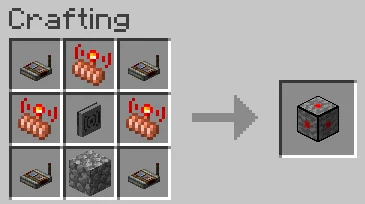

# CC: Create Redstone Link

Based on <https://modrinth.com/mod/cc-redstone-link-bridge>. I would have simply contributed the additional feature of adding color support there, but unfortunately that mod is not source available (despite the MIT license on its page).

This mod connects **Create Redstone Link networks** with **CC:Tweaked computers**. It adds a single block, the **CC Redstone Link Bridge**, which can be placed in the world and then used as a ComputerCraft peripheral.

This mod requires **Create** and **CC:Tweaked**.

## What the Mod Does

The bridge acts as a small adapter between two systems:

- **Create** provides the Redstone Link network.
- **CC:Tweaked** provides Lua control from computers.

Optionally, this mod is Sable-compatible.

With the bridge block in the world, a connected computer can:

- read the current signal strength of any Redstone Link frequency pair
- send a signal strength to any Redstone Link frequency pair
- subscribe to signal changes using ComputerCraft events
- optionally use dyed item frequencies with 24-bit RGB colors

The peripheral follows the config rule **Link Range** defined by **Cteate**. It acts like redstone link transimitter.

The mod is intentionally minimal. The Lua interface only exposes the operations required for direct network interaction.

## How It Works

The peripheral exposes three core operations:

- `getLinkSignal(freq1, freq2)` reads the current signal strength.
- `sendLinkSignal(freq1, freq2, strength)` transmits a signal.
- `hookLinkSignal(freq1, freq2)` subscribes to changes on a frequency pair.

Whenever a hooked signal changes, the bridge queues a ComputerCraft event:

```lua
"redstone_link_signal_changed", frequency1, frequency2, signal
```

The frequency values may be either:

- an item ID string such as "minecraft:iron_ingot"
- or a Lua table describing both item and optional color

Example frequency table:
```lua
{id="minecraft:leather_chestplate", color=0xFF3344}
```
An empty string ("") is treated as "minecraft:air".

## Crafting Recipe


The recipe is a 3×3 shaped craft with Redstone Links in all four corners, a Wireless Modem in the center, and Cobblestone in the bottom-middle slot. The three remaining middle-edge slots (top-middle, middle-left, and middle-right) are filled with Create transmitters.

## Lua API
### Peripheral type:
- `redstone_link_bridge`

### Methods:
- `getLinkSignal(freq1, freq2) -> number`
- `sendLinkSignal(freq1, freq2, strength)`
- `hookLinkSignal(freq1, freq2)`

### Frequency Values
freq1 and freq2 may be either:
#### Item ID Strings
Examples:
- `"minecraft:iron_ingot"`
- `"minecraft:oak_sapling"`
- `"minecraft:redstone"`
#### Frequency Tables
A frequency may also be represented as a Lua table:

```lua
{id="minecraft:leather_chestplate", color=0xFF3344}
```

Fields:
- `id` - the item registry ID
- `color` - optional 24-bit RGB value in the form `0xRRGGBB`

These match the items physically placed into the two frequency slots of a Create Redstone Link.

Use an empty string (`""`) to represent an empty frequency slot. Empty strings are internally treated as `"minecraft:air"`.

### Freqency Colors

Colors are only meaningful when the corresponding item supports Minecraft's DYED_COLOR data component. In vanilla Minecraft, this includes:
- leather armor
- leather horse armor

A colored slot is considered a different Redstone Link frequency from the same item without color, and different colors produce distinct networks.

Useful vanilla dye RGB values:
- `0xB02E26` — Red Dye
- `0x3C44AA` — Blue Dye
- `0xFED83D` — Yellow Dye
- `0x5E7C16` — Green Dye
- `0x1D1D21` — Black Dye
- `0xF9FFFE` — White Dye

### Signal Hooks and Events
`hookLinkSignal(freq1, freq2)` registers a listener for signal changes on the specified frequency pair.

Whenever the signal strength changes, the bridge queues the following event on attached ComputerCraft computers:

```lua
"redstone_link_signal_changed", frequency1, frequency2, signal
```

Event arguments:

- `frequency1` — frequency table with keys id and optional color
- `frequency2` — frequency table with keys id and optional color
- `signal` — new signal strength (0–15)

This is generally more efficient than repeatedly polling getLinkSignal in a loop.

### Example

```lua
local bridge = peripheral.find("redstone_link_bridge")
assert(bridge, "No redstone_link_bridge found")

-- Read an existing frequency pair
local current = bridge.getLinkSignal(
    "minecraft:diamond",
    "minecraft:redstone"
)

print("Current signal:", current)

-- Send a signal to a frequency pair
bridge.sendLinkSignal(
    "minecraft:diamond",
    "minecraft:redstone",
    7
)

-- Send on a color-tagged channel
bridge.sendLinkSignal(
    {id="minecraft:leather_chestplate", color=0xB02E26},
    {id="minecraft:leather_helmet", color=0x3C44AA},
    15
)

-- Read from a color-tagged channel
local coloredSignal = bridge.getLinkSignal(
    {id="minecraft:leather_chestplate", color=0xB02E26},
    {id="minecraft:leather_helmet", color=0x3C44AA}
)

print("Colored signal:", coloredSignal)

-- Listen for signal changes
bridge.hookLinkSignal(
    {id="minecraft:leather_chestplate", color=0xB02E26},
    {id="minecraft:leather_helmet", color=0x3C44AA}
)

while true do
    local event, freq1, freq2, signal =
        os.pullEvent("redstone_link_signal_changed")

    print(string.format(
        "Signal on %s/%s changed to %d",
        freq1.id,
        freq2.id,
        signal
    ))
end
```
